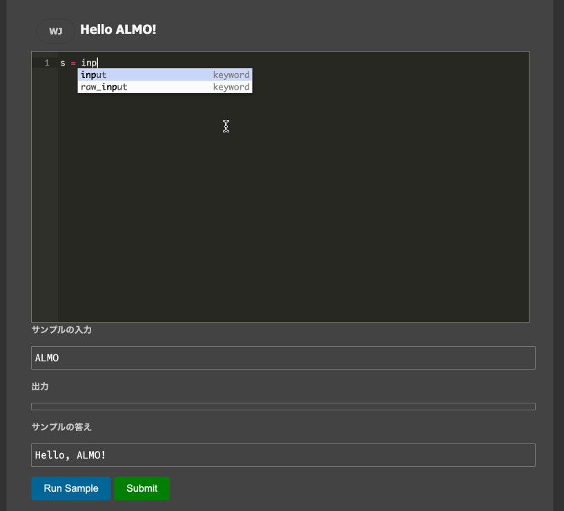

# ALMO


<p align="center">

</p>


ALMOは、C++製の拡張Markdownパーサ・静的サイトジェネレータです。 

WebAssemblyを使って実行・ジャッジ環境同梱のHTMLファイルを作ることができます。

## 機能

ALMOは、Markdown記法によって執筆された記事をHTMLファイルに変換することができます。

加えて、ALMOの拡張構文は、

- 競技プログラミング
- データ分析
- 科学技術計算

をはじめとしたプログラミングに関する様々な記事を作成するために設計されています。

### 実行可能コードブロック

一つ目の拡張構文は実行可能なコードブロックです。

```
:::code
# このコードは自分自身を出力します！　

# 実行して確かめよう

_='_=%r;print(_%%_)';print(_%_)
:::
```

という記法は、以下のようなコードブロックを生成します。

さらにコードは実行することができ、**その実行はCPythonのWebAssemblyへの移植であるPyodideによっておこなわれます。**

そのため、記事の執筆者は自分でサーバを用意することなく、簡単に実行可能なサンプルコードを提供することができます。


### Pythonのライブラリの使用 / matplotlib によるグラフ描画

実行可能コードブロックでは、Pythonの主要なライブラリを利用できます。

```
:::loadlib
numpy
matplotlib
:::
```

などとすることで、 `numpy`, `matplotlib` を利用できるようになります。

さらに、`matploblib` によるグラフ描画も可能です。

ソースコード内で、　

```python
import matplotlib
matplotlib.use("module://matplotlib_pyodide.html5_canvas_backend")
```

とすると、通常のように `plt.show()` するだけで出力欄にインタラクティブなプロットを表示できます。


### ジャッジシステム

競技プログラミングなどで用いられるジャッジシステムも提供します。

```
:::judge
title=Hello ALMO!　　　                        
sample_in=example/helloalmo/in/sample.txt     
sample_out=example/helloalmo/out/sample.txt  
in=example/helloalmo/in/*.txt                 
out=example/helloalmo/out/*.txt               
:::
```

という記法によって、

- サンプル入力は `example/helloalmo/in/sample.txt` 
- サンプル出力は `example/helloalmo/out/sample.txt`
- 入力ファイルは `example/helloalmo/in/*.txt`　にマッチする全てのファイル
- 出力ファイルは `example/helloalmo/out/*.txt`　にマッチする全てのファイル

と対応したジャッジシステムを自動で構築します。




これらは全て[デモページ](https://www.abap34.com/almo.html)で試すことができます。


## インターフェース

`almo <入力> [オプション]`


オプション:

-  `-o <出力>`     出力ファイル名を指定します。 指定しない場合、HTMLファイルが標準出力に出力されます。
-  `-t <テーマ>`   テーマを指定します。デフォルトは light です。
-  `-c <CSSファイルへのパス>`   CSSファイルを指定します。デフォルトは テーマに付属するものが使用されます。
-  `-e <テーマ>`   エディタのテーマを指定します。デフォルトは light の場合、 `ace/theme/chrome`, dark の場合 `ace/theme/monokai` が使用されます。 [使用可能なテーマ](https://github.com/ajaxorg/ace/tree/master/src/theme)
-  `-d`            デバッグモードで実行します。 
-  `-g`            構文木をdot言語として出力します。
-  `-h`            ヘルプを表示します。


## インストール方法

macOS (Apple Silicon) では、 Homebrew を使ってビルド済みのバイナリをインストールできます。

```bash
brew tap abap34/homebrew-almo
brew install almo
```

それ以外の環境では、 `build.sh` を実行することでビルドすることができます。

## エコシステム

- https://github.com/abap34/ALMO-extension
  - ALMO でファイルを編集する際にリアルタイムプレビューを行う VSCode の拡張機能です。
- https://github.com/abap34/ALMO-blog-template
  - ALMO を使って簡単にブログを構築するためのテンプレートです。