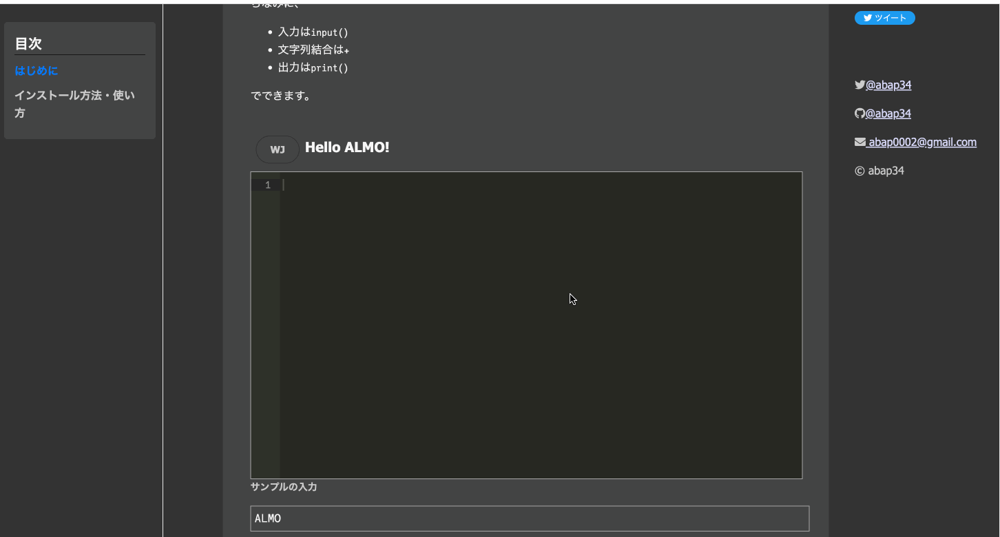

# ALMO


ALMOはC++製の拡張Markdownパーサです。 

ALMOは、WebAseemblyを使ってブラウザ上で完結する実行とジャッジ環境を提供します。 ([デモページ](https://www.abap34.com/almo.html)
)




## 使い方

`almo [options] <markdown file>`

### オプション

以下は全て省略可能です。


- `-o <output file>`: 出力ファイル名を指定します。デフォルトは`index.html`です。 
- `-t <theme>` : テーマを指定します。デフォルトは`light`です。`light`または`dark`を指定できます。
- `-d` : デバッグモードにします。デフォルトはオフです。　パースされた結果がJSON形式で標準出力に出力されます。
- `-h` : ヘルプを表示します。

## インストール方法

```bash
brew tap abap34/homebrew-almo
brew install almo
```

## 使える記法

- H1, H2, H3, H4, H5, H6
```
# H1
## H2
### H3
#### H4
##### H5
###### H6
```
- コードブロック
~~~
```language
Code Block. Hightlight.jsによってシンタックスハイライトが入ります
```

`Inline CodeBlock`
~~~

- 数式
```
# 複数行
$$
f(x) = x^2
$$

# インライン
$f(x) = x^2$
```

- 打ち消し、強調、イタリック
```
~~overline~~, **strong**, *italic*
```

- リンク、画像
```
[name](url)

```

- リスト
```
- list1
- list2
 - list2-1
 - list2-2
- list3
```

- 表
```
| col1 | col2 | col3 |
| :--- | ---: | :---: |
|  value1 | value2 | value3 |
```

- 実行可能コードブロック

~~~
:::code
title=Hello ALMO!　　　                        # タイトル
sample_in=example/helloalmo/in/sample.txt     # サンプル入力
sample_out=example/helloalmo/out/sample.txt   # サンプル出力
in=example/helloalmo/in/*.txt                 # 入力
out=example/helloalmo/out/*.txt               # 出力
judge=equal                                   # ジャッジの方法。デフォルトは`equal`で省略可能. `err_{rate}`と書くと絶対誤差が`rate`以下の場合許容される。
source=example/helloalmo/src/sample.py        # このコードがデフォルトで入力された状態で表示される。
:::
~~~
